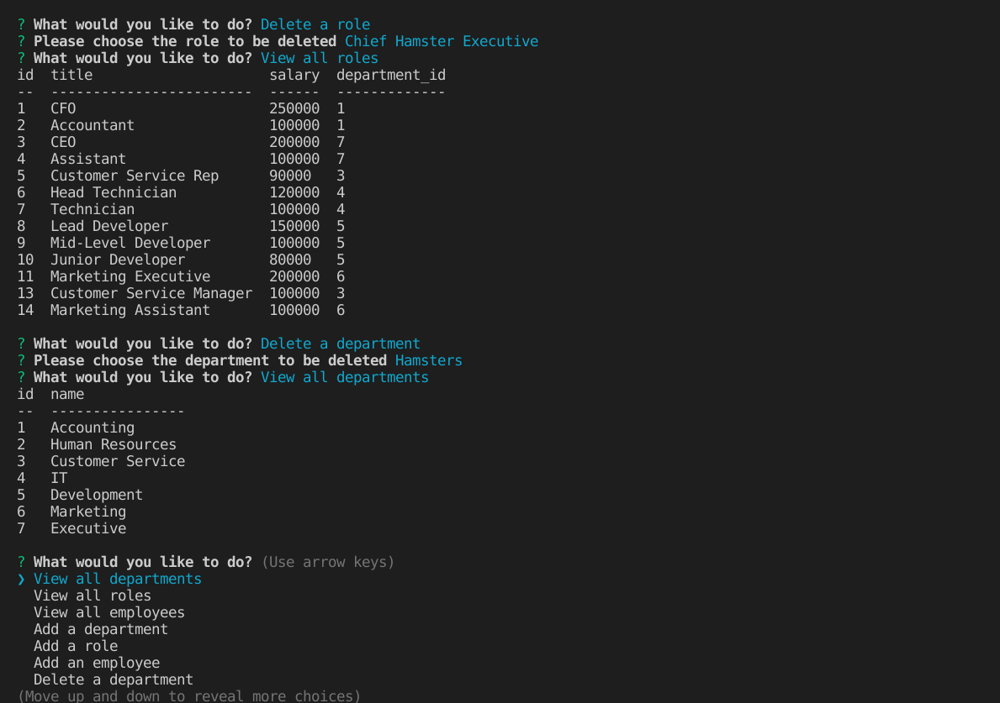

# track-your-suits
  ## Table of Contents
  * [Description](#description)
  * [Installation](#installation)
  * [Screenshot](#screenshot)
  * [Video](#video)
  * [Questions](#questions)

  ## Description

This is a cli tool I made that uses mysql to track employees. with this cli, you can view departments, roles and employees; add departments, roles and employees; update employee roles and managers as well as delete departments, roles and employees.

  ## Installation

  To install run npm i. To start run "npm run test" in the command line. 

  ## Screenshot
  Here is a screenshot of it working.

  

  ## Video
  [Here is the video](./images/Trackyoursuitsvid.webm)

  ## Questions
  
  If you have any questions please check out [my github](https://github.com/Naomilounsbury/track-your-suits) 
